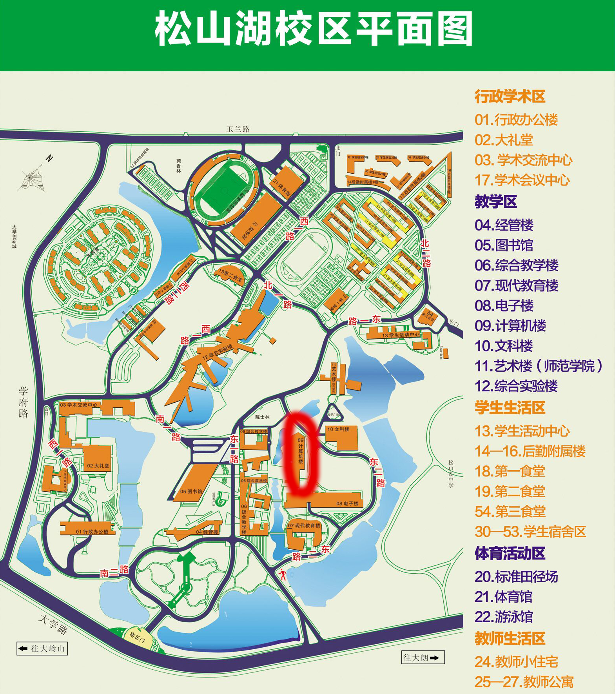

<section id="contact" class="home-section wg-contact" style="padding: 0; width: 95%;">
    

        

            

                <ul class="fa-ul">
                    <li style="margin-bottom: 20px;">
                        <i class="fa-li fas fa-envelope fa-2x" aria-hidden="true"></i>
                        
                            <a href="mailto:wangyi@dgut.edu.cn">wangyi@dgut.edu.cn</a>
                        
                    </li>
                    <li style="margin-bottom: 20px;">
                        <i class="fa-li fas fa-phone fa-2x" aria-hidden="true"></i>
                        
                            <a href="tel:+86%200769-2286-2015">+86 （0769） 2286 2015</a>
                        
                    </li>
                    <li style="margin-bottom: 20px;">
                        <i class="fa-li fas fa-compass fa-2x" aria-hidden="true"></i>
                        School of Cybersecurity, Building 9A, Level 3, Room 301
                    </li>
                    <li style="margin-bottom: 20px;">
                        <i class="fa-li fas fa-map-marker fa-2x" aria-hidden="true"></i>
                        No.1 University Road, Songshan Lake, Dongguan, Guangdong, China 523808
                    </li>
                </ul>
            

            

                
            

        

    

</section> 