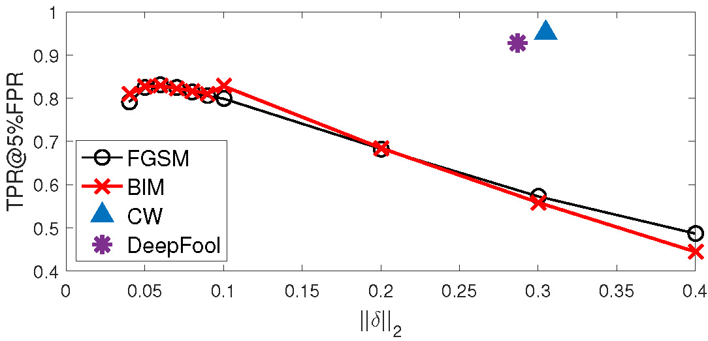
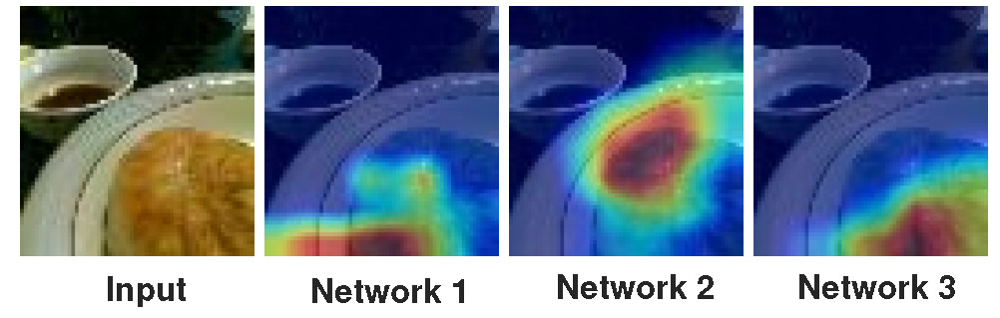
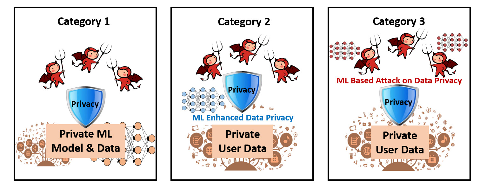

 
<!-- 

  

 -->

  
        The DGUT ALIS-Lab was established in 2016, fcousing on the security and privacy issues involved in Artificial Intelligence. Professor Yi Wang is the director of the laboratory. The current specific research topics mainly include the following aspects.
      
      <ul>
        <li>
          <a href="#Adversarial-Attacks">Adversarial Attacks</a>
        </li>
        <li>
          <a href="#Adversarial-Detection">Adversarial Detection</a>
        </li>
        <li>
          <a href="#Improving-Adversarial-Robustness">Improving Adversarial Robustness</a>
        </li>
        <li>
          <a href="#Privacy-Protection">Privacy Protection</a>
        </li>
        <li>
          <a href="#Causality-Inference">Causality Inference</a>
        </li>
        <li>
          <a href="#Anomaly-Detection">Anomaly Detection</a>
        </li>
      </ul>

  

  <h2 name="Adversarial-Attacks" style="display: block; text-align: center; margin: 50px 0 20px 0;">
    Adversarial Attacks
  </h2>
  

    

      
        Although deep learning has made enormous success in many fields, for instance, deep neural networks (DNNs) can reach or exceed human-level performance in image recognition. However, some studies have shown that DNNs are vulnerable to adversarial examples, which are generated by adding small perturbations almost invisible to human eyes to fool DNNs. The literature is seeing a fast-growing number of adversarial examples generation algorithms, which can be roughly divided into:
        1)	White-box attacks assume that the adversary knows all knowledge about the trained model: training data, network architectures, model parameters, etc. Most of these attacks are constructed with explicit model information, e.g., loss gradients. 
        2)	Black-box attacks assume that the adversary has no access to the trained model, the adversary, acting as a standard user, only knows the output of the model (label or confidence score). This assumption is common for attacking online Machin Learning Services (e.g., Machine Learning on AWS2, Google Cloud AI3). Currently, our research interests mainly focus on query-efficient black-box attacks due to its more practical application.
      
      <ul>
        <!-- <li>Adversarial Machine Learning</li>
        <li>Federated Learning</li>
        <li>Generated Adversarial Network</li> -->
      </ul>
    

    

      

        
      

      <!-- 

        
      
 -->
    

  

  

  <h2 name="Adversarial-Detection" style="display: block; text-align: center; margin: 50px 0 20px 0;">
    Adversarial Detection
  </h2>
  

    

      
        Adversarial detection aims to distinguish adversarial examples from normal inputs and then by refusing to make prediction on malicious inputs to protect the trained model. By directly dealing with the learning model or not, adversarial detection methods may be further classified into model-dependent and model-agnostic approaches. The dependent schemes often leverage the underlying model properties or internal states to detect the adversarial class such as by adding detection layers/subnetworks or changing the loss/activation function. The model-agnostic detectors are mainly built based on analyzing the input and/or output feature characteristics without requiring access to the model under protection. Therefore, developing model-agnostic adversarial detection approach is important, we are researching on this meaningful topic.
      
      <ul>
        <!-- <li>Adversarial Machine Learning</li>
        <li>Federated Learning</li>
        <li>Generated Adversarial Network</li> -->
      </ul>
    

    

      

        
      

      <!-- 

         -->
      

    

  

  

  <h2 name="Improving-Adversarial-Robustness" style="display: block; text-align: center; margin: 50px 0 20px 0;">
    Improving Adversarial Robustness
  </h2>
  

    

      
        Many adversarial defenses focus on improving model robustness, which aim at making the underlying model more robust to adversarial attacks. Many techniques have been proposed in recent years, among which adversarial training can be considered as the most practical strategy to defend against adversarial attacks. However, adversarial training requires to generate large volumes of adversarial examples during the training phase, which introduces a high computational complexity. Moreover, it is unable to provide a guarantee that no adversarial example is capable of fooling model exists in the neighborhood of the given input, and the optimization is subject to the effectiveness of the attack method used in adversarial training. More importantly, there is generally a trade-off between classification accuracy and adversarial robustness for many defenses. Our research interest is to find more certified and effective mechanisms to make sure model security.
      
      <ul>
        <!-- <li>Adversarial Machine Learning</li>
        <li>Federated Learning</li>
        <li>Generated Adversarial Network</li> -->
      </ul>
    

    

      

        
      

      <!-- 

         -->
      

    

  

  

  <h2 name="Privacy-Protection" style="display: block; text-align: center; margin: 50px 0 20px 0;">
    Privacy Protection
  </h2>
  

    

      
        The field of machine learning privacy security includes two aspects. One is to focus on privacy leakage and expose privacy problems in machine learning models, including membership inference, property inference, sample reconstruction, and model extraction. Another focuses on privacy protection issues and studies how to prevent machine learning models from leaking privacy, including differential privacy, model compression, selective sharing and etc. Our research interest is privacy security issues in deep learning, including training data privacy and model privacy. At present, we have a certain understanding of the privacy issues in collaborative learning and have in-depth research on the data privacy leak from gradient.
      
      <ul>
        <!-- <li>Adversarial Machine Learning</li>
        <li>Federated Learning</li>
        <li>Generated Adversarial Network</li> -->
      </ul>
    

    

      

        
      <!-- 
 -->
      <!-- 

         -->
      <!-- 
 -->
    

  

  
  

  <h2 name="Causality-Inference" style="display: block; text-align: center; margin: 50px 0 20px 0;">
    Causality Inference
  </h2>
  

    

      
        Causality is a generic relationship between an effect and the cause that gives rise to it. It is hard to define, and human often only know intuitively about causes and effects. When it comes to learning causality with data, researchers need to be aware of the differences between statistical associations and causations. It contains spurious and causal relationship in the statistical associations. The former makes deep model less effective, and the latter is significant for both classification and detection task. Causality Inference is an interpretable pattern for majority of applications，such as supervised learning，semi-supervised learning domain adaptation，reinforcement learning, disentanglement and so on. We are currently exploring disentanglement learning to find major factors which are meaningful for the downstream task in various data.
      
    

    

      

        
      <!-- 
 -->
      <!-- 

         -->
      <!-- 
 -->
    

  

  

  <h2 name="Anomaly-Detection" style="display: block; text-align: center; margin: 50px 0 20px 0;">
    Anomaly Detection
  </h2>
  

    

      
        Anomaly detection is a step in data mining that identifies data points, events, and/or observations that deviate from a dataset’s normal behavior. Anomalous data can indicate critical incidents, such as a technical glitch, or potential opportunities, for instance a change in consumer behavior. Therefore, anomaly detection is an important problem that has been researched within diverse research areas and application domains. We are currently researching and developing a more general anomaly detection approach to provide a stronger guarantee for real application.
      
    <!-- 

    

      

        
      

      

        
      

    
 -->
  

  

<!-- 

  

   
  

    <h2> WQW </h2>
    <ul style="margin: 20px;">
      <li>Adversarial Machine Learning</li>
      <li>Federated Learning</li>
      <li>Generated Adversarial Network</li>
    </ul>
  

   

 -->

