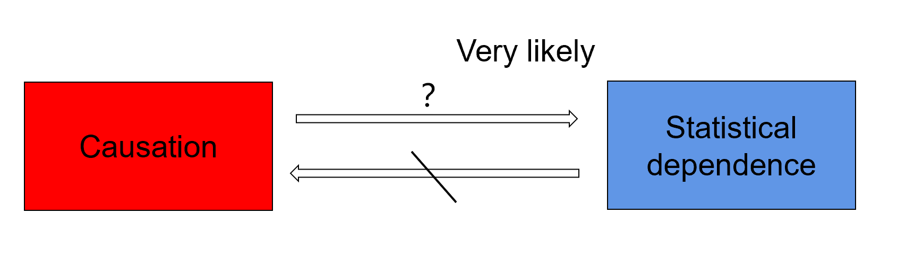

<!-- 

  
  Nowadays, deep learning is playing a core function in various real-world applications. Recent studies found that deep learning systems are vulnerable to attacks by adversarial machine learning. For example, adversarial examples can cause malfunction of the system at inference time. It is a cat-and-mouse game between adversarial attacks and defense. Existing approaches of both sides are often ad-hoc and thus limited in more realistic situations. We are interested in studying explainable methods that can achieve a better trade-off between the utility and security/privacy requirements of deep learning. The following are research areas that we are currently working on.
  

 

<h1 class="mb-0">In RESEARCH</h1>

  -->
<!-- 

  

 -->

  

  
        Nowadays, deep learning is at the core of many real-world application systems. Recent studies have found that deep learning empowered systems can be easily compromised by adversarial machine learning (AML). Like in other security studies, it is a cat-and-mouse game between the adversarial attacks and defense for deep learning. Existing methods from both sides are often ad-hoc and thus limited by their power to adapt in more realistic scenarios. We intend to gain better understanding of the learning process from both sides and achieve a better trade-off between the utility and security/privacy requirements of system models. The following are some research areas that we are currently working on:
  
   
  <!-- 
 -->
      <ul style="padding-top: 30px;">
        <li>
          <a href="#Adversarial-Attacks">Adversarial Attacks</a>
        </li>
        <li>
          <a href="#Adversarial-Detection">Adversarial Detection</a>
        </li>
        <li>
          <a href="#Model-Robustness">Model Robustness</a>
        </li>
        <li>
          <a href="#Privacy-Aware-Learning">Privacy-Aware Learning</a>
        </li>
        <li>
          <a href="#Causality-Inference">Causality Inference</a>
        </li>
        <li>
          <a href="#Anomaly-Detection">Anomaly Detection</a>
        </li>
      </ul>

  

  <h2 id="Adversarial-Attacks" style="display: block; text-align: center; margin: 50px 0 20px 0;">
    Adversarial Attacks
  </h2>
  

    

      
        Deep neural networks (DNN) have made significant progresses in a wide domain of machine learning, including image classification, object detection, automatic speech recognition, content-based image retrieval (CBIR), steganography, and more. DNN provides an end-to-end learning approach that automates feature extraction with higher and more abstract level representation from the raw input. Recently, deep learning is found to be vulnerable under adversarial attacks. In particular, malicious input can be generated by imposing adversarial perturbations on the original input. Such adversarial examples are designed to induce wrongful decisions of the system model and are often imperceptible to human eyes. Currently, we are working on a number of query-efficient black-box attacks on different DNN-based application systems. Figure 1 illustrates an example of adversarial attack on CBIR systems, where the top-K retrieval results are subverted by an adversarial example of the query image.
      
    

    

      

        
      

      

        Figure 1 An example of adversarial attack on CBIR systems.
      

    

  

  

  

  <h2 id="Adversarial-Detection" style="display: block; text-align: center; margin: 50px 0 20px 0;">
    Adversarial Detection
  </h2>
  

    

      
        Adversarial detection attempts to distinguish adversarial examples from the normal inputs. The goal is to maximize the chance of allowing only the legitimate input to the intended model. Adversarial detection methods may be classified into model-dependent and model-agnostic approaches depending on interacting with the intended model or not. The dependent schemes often leverage the underlying model properties or internal states to detect the adversarial class, e.g., by adding detection layers/subnetworks or changing the loss/activation function. The model-agnostic detectors are mainly built based on analyzing the input and/or output feature characteristics without requiring access to the intended model. Currently, we are working on model-agnostic methods for adversarial detection at different layers of DNN. For example, we apply random perturbations to the model input for multiple times and use the statistical patterns of relative changes in the model output for adversarial detection. Figure 2 shows the detection accuracy of this method which is particularly effective for detecting small adversarial perturbations.
      
    

    

      

        
      

      

        Figure 2 Adversarial detection accuracy of a model-agnostic method with respect to an increasing strength of adversarial perturbation.
      

    

  

  

  <h2 id="Model-Robustness" style="display: block; text-align: center; margin: 50px 0 20px 0;">
    Model Robustness
  </h2>
  

    

      
        Adversarial defense aims at improving the model robustness against adversarial attacks. Many defense techniques have been proposed in recent years. Popular defense paradigms include randomization techniques and training with regularizations. However, many of them are later shown defeated by stronger iterative attacks or adaptive adversaries.  So far, adversarial training has been considered as a standard method for defending against adversarial examples by data augmentation. However, adversarial training requires to generate large volumes of adversarial examples during the training phase, which introduces a high computational complexity. In general, there is a trade-off between classification accuracy and adversarial robustness in many defense methods. We are currently working on more effective methods of adversarial training by reducing its cost and improving its generalizability.  Figure 3 demonstrates our method of improving model robustness by promoting diversified simultaneous training of deep ensembles in comparison with STOA.
      
    

    

      

        
      

      

        Figure 3 Improving model robustness by promoting diversified learning of deep features in deep ensembles.
      

    

  

  

  <h2 id="Privacy-Aware-Learning" style="display: block; text-align: center; margin: 50px 0 20px 0;">
    Privacy-Aware Learning
  </h2>
  

    

      
        Privacy-aware machine learning includes two aspects: 1) privacy leakage, and 2) privacy protection. In privacy leakage, an attacker intends to derive sensitive information from machine learning models. The privacy leakage problems include membership inference, data property inference, sample reconstruction, and model extraction. In privacy protection, one studies the countermeasures of how to prevent machine learning models from leaking privacy, e.g., differential privacy, model compression, selective sharing and more. We are currently studying privacy and security issues in deep learning, including training data privacy and model privacy. Examples are various inference attacks in collaborative learning and inference-based similarity search for privacy-preserving biometric identification. Figure 4 demonstrates three different categories of research problems in privacy and machine learning.
      
    

    

      

        
      

      

        Figure 4 Three different categories of research problems in privacy and ML: (a) Privacy of ML model and data; (b) ML enhanced privacy protection; (c) ML-based privacy attack.
      

    

  

  
  

  <h2 id="Causality-Inference" style="display: block; text-align: center; margin: 50px 0 20px 0;">
    Causality Inference
  </h2>
  

    

      
        Causality is a generic relationship between an effect and the cause that gives rise to it. It is hard to define, and even human being often only know intuitively about causes and effects. When it comes to learning causality with data, researchers need to be aware of the differences between statistical associations and causations. As shown in Figure 5, the statistical dependence reflected from deep features is not equal to the relationship of causation. Whereas the causation is likely to infer statistical dependence. It contains spurious and causal relationship in the statistical associations. Causality inference helps interpretability of machine learning and has been used in a number of fields including supervised learning, semi-supervised learning, domain adaptation, reinforcement learning, disentanglement learning and so on.  
      
    

    

      

        
      

      

        Figure 5 The relationship between causation and statistical dependence.
      

    

  

  

  <h2 id="Anomaly-Detection" style="display: block; text-align: center; margin: 50px 0 20px 0;">
    Anomaly Detection
  </h2>
  

    

      
        Anomaly detection is an important topic in data mining to identify data points, events, and/or observations that deviate from the data’s normal behavior. Anomalous data can indicate critical incidents, such as a technical glitch, or potential opportunities, e.g., a change in consumer behavior. We are currently developing one-class classifiers for anomaly detection. We are also interested in studying the relationship between anomaly detection and adversarial examples. Figure 6 illustrates the differences.
      
    

    

      

        
      

      

        Figure 6 Difference of OOD examples and adversarial examples.
      

    

  

<!-- 

  <h2 id="Anomaly-Detection" style="display: block; text-align: center; margin: 50px 0 20px 0;">
    Anomaly Detection
  </h2>
  

    

      

        
          Anomaly detection is an important topic in data mining to identify data points, events, and/or observations that deviate from the data’s normal behavior. Anomalous data can indicate critical incidents, such as a technical glitch, or potential opportunities, e.g., a change in consumer behavior. We are currently developing one-class classifiers for anomaly detection. We are also interested in studying the relationship between anomaly detection and adversarial examples. Figure 6 illustrates the differences.
        
      

      

        
        

          Figure 6 Difference of OOD examples and adversarial examples.
        

      

    

  

 -->

<!-- 

  

   
  

    <h2> WQW </h2>
    <ul style="margin: 20px;">
      <li>Adversarial Machine Learning</li>
      <li>Federated Learning</li>
      <li>Generated Adversarial Network</li>
    </ul>
  

   

 -->

